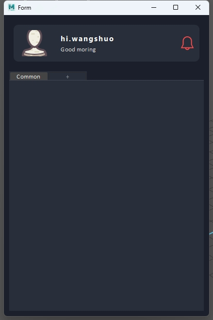

# Envlt

## 这是环境工具，集合了资产，地形，散布的功能

***

## 开发日志

### _wangshuo_  _zhuyihan_

***

### 2024/07/03

- [x] 更新envlt`操作图片`的api(rust)
```python
from ns_Envlt.envlt_image import Image

image = Image(r"C:\Users\wangshuo\Pictures\Screenshots\屏幕截图 2023-11-15 102317.png",
              r"C:\dev\maya\Envlt\src\envlt_image_rs\tests\aaa.png")
# 缩放图片分辨率
image.resize_image(960, 540)
# 获取图片分辨率
image_size = image.get_image_size()
print(f"width: {image_size.width} height: {image_size.height}")
```
- [x] `ns_Envlt/utils`目录下新增`info_fuction.py`用于消息通知 
```python
# Sample
from ns_Envlt.utils import info_function

def delete_notification(self, scene_name):
    title = f"Notification {len(info_function.NotificationWidget.instances) + 1}"
    message = f"Scene {scene_name} has been Deleted."
    new_notification = info_function.NotificationWidget(title, message)

```
- [x] 修改`mainWindow`下创建和克隆时上传图片的逻辑，将缩略图和原图的二进制数据保存为一个字典.根据不同情况调用不同图片
  - [x] 生成缩略图所用模块为`PIL`和`io`
  - [x] 在二进制数据字典上传数据库时将其转换为了`字符串`。后续调用前需使用将其还原为`字典`
```python
"""
image_data_dict = {
                "original": original_image_data,
                "small": thumbnail_data
            }
"""
```
- [x] 修改`image_window`模块.
  - [x] 现在打开参考图时可以调整显示比例，不会因为原图过大而导致看不到完整图片
  - [x] 将`ImageWindow `类继承修改为`QWidget`,这样就不会在打开参考图时阻塞窗口
***

### 2024/07/02

- [x] 更新`project_ui.py`,添加场景搜索功能
- [x] `ns_Envlt\utils`目录下新增`override_function.py`,该模块主要存放重写的方法
- [x] 场景删除新增二次确认.
- [x] 右键上下文菜单新增打开场景参考图功能
- [x] 更新database 模块
    1. `base_db`数据库基类
    2. `asset_db` 资产类数据库类 控制资产表
    3. `master_db` 场景总视图表类 控制场景总视图

### `asset_db` 和 `master_db` 都继承`base_db`类

```python
""""""
"""base_db 里放一些通用的函数"""

"""创建master_db来控制项目总表类"""
from ns_Envlt.envlt_db import master_db

db_master = master_db.EnvltProjectDatabase()
# 往下填写相关代码
"""创建asset_db类控制资产表"""
from ns_Envlt.envlt_db import asset_db

db_asset = asset_db.EnvltAssetDB()
# 往下填写相关代码
```

### 优化代码（元组解包） 将sqlite获取的数据自动解包

```python
# dataclass = insert_dataclass(*data)
# 代码前面加个*代表将元组拆开为单独的元素,这样写更方便
```

- [x]  更新图片存储数据库方式为 `二进制存储方式`

***

### 2024/07/01

- [x] `project_ui.py`模块下新增每个场景的右键上下文菜单，实现对已有场景的删除 _(测试阶段还未限制用户权限)_
    - [x] 修改`HoverableFrame`类，发出右键点击信号
    - [x] `ProjectUI` 类中新增 `on_frame_right_clicked`,`show_context_menu`, `delete_scene`
      .分别对应：触发右键信号，显示点击的frame对应的上下文菜单，场景删除操作
    - [x] `envlt_database.py`模块下新增`delete_data_from_project_data`,`drop_table`.用以实现删除总表索引和对应场景的表格
- [x] `mainWindow.py`下新增`refresh_project_page`,用以实现在新建，克隆或删除场景后实时更新`project`页面。
- [x] `mainWindow.py`下新增`init_create_scene_check_label`,并完成`check_scene_exists`。用于实现重复场景名提示

- [x] 添加config类 用来设置/读取配置项
    - [x] json_config_factory

```python
# 读取配置
import os
from ns_Envlt.config.json_config_factory import JsonConfigFactory

blacklist_path = os.path.join(os.path.dirname(__file__), "../../config/blacklist.json")
json_factory = JsonConfigFactory(blacklist_path)
json_data = json_factory.parser()
```

- [x] 设置scene libs ui界面



***

### 2024/06/28

- [x] 开发日志系统
    - 创建日志:

```python
### 创建日志类

from ns_Envlt.envlt_log import log_factory

# 定义一个log农场
log = log_factory.LogFactory(log_name="unit_test2", user_dir=False)
# 写入日志
log.write_log(log_level=log_factory.LogLevel.INFO, content="my_test")
# 列举出所有日志路径
log.list_all_logs_path(user=False)
# 列举出指定数量的日志路径
log.list_logs_path(user=False, limit=1)

# 读取日志内容
log_file = log_factory.LogFileFactory(log_factory=log)
log_contents = log_file.read_line_content()  # 获取日志会从log农场提取logs_path_list的属性
```

- [x] 构建`Project`页面,实现场景信息的放置与自动排列。
    - [x] `mainWindow`同目录下添加`project_ui.py`.
    - [x] 修改`envlt_database`中的`get_asset_libs_data`方法,若传入表名为总表名则不添加`_libs`后缀.

***

### 2024/6/27

- [x] 开发场景克隆功能:
    - [x] `envlt_database`模块中新增`insert_data_to_table`方法,用于往表中插入数据,接受参数类型为`列表`和`字符串`
    - [x] `mainWindow`中完成`_clone_scene`方法
- [x] 其余修改项：
    - [x] 修改`mainWindow`中`choose_image`方法,使其可以根据触发槽函数对象不同设置不同文本框的内容
    - [x] 将`mainWindow`中`now_time`变量设置为初始化变量,用于`_clone_scene`方法

***

### 2024/06/26

- [x] 开发建立资产表的功能
- [x] 开发项目克隆功能

***

### 2024/06/25

- [x] 开发创建新场景的功能
    - [x] 上传图片功能
    - [x] 创建temp临时配置文件类
        - 记录QFileDialog上次选择路径，temp/envlt/config/file_dialog_last_choose.json
    - [x] 增加 检查场景存在功能
    - [x] 写入数据库
- [x] 增加自定义MessageBox
    - [x] 支持information, warning, error

***


   